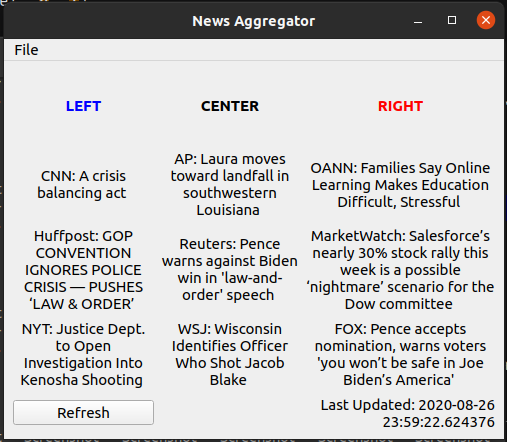

# News_Aggregator

This is a desktop application with the purpose of aggregating news from a variety of sources into one easy to use platform. As long as the news is reported by humans it will never be reported without bias, so my goal in creating this project is to gather many different perspectives on current events in an attempt to present the news as clearly as possible. 

Future Goals:
* Possible implementation in a larger project:(attempt at correlating the sentiment of major headlines with stock prices)
* Expansion into a web environment as a form of social media

Currently Being Implemented:
* Unit tests
* Finish "Add new outlet" backend
* Create an object to store all past and future headlines for future historical analysis
* Add support for social media

Major Frameworks: 
1. PyQt5
2. Selenium

Status:
Functional - new features being implement and bug fixing
